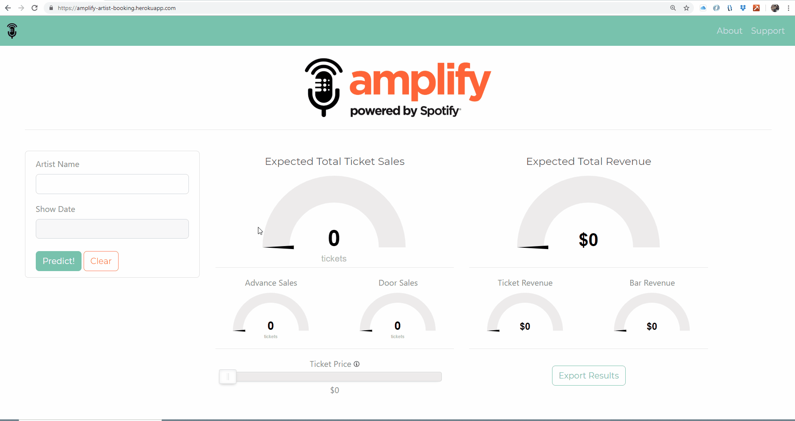
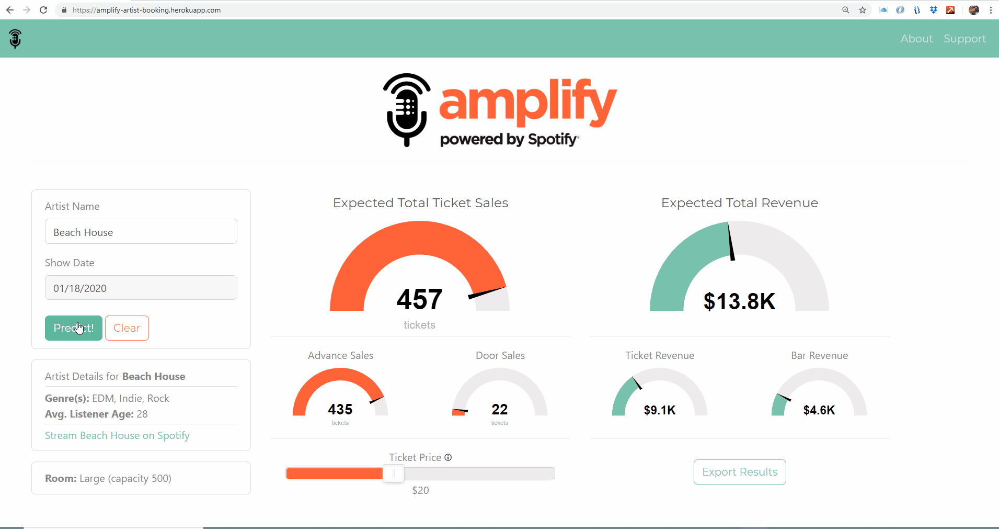
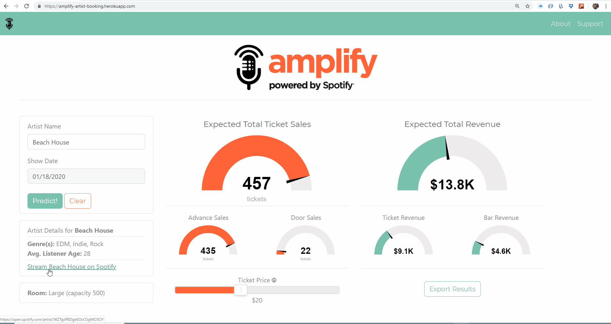
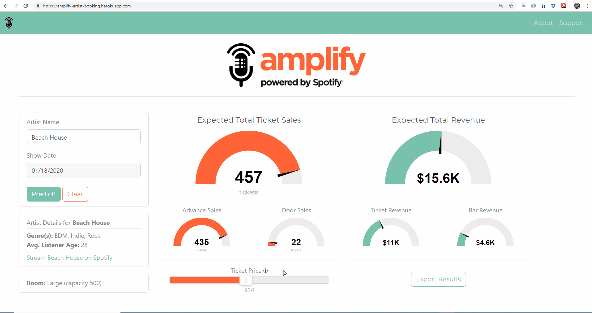

### At **amplify**, we believe in the power of live music. Live music is energetic, collaborative, and unpredictable. Fans have a unique opportunity to connect intimately with artists they love, and artists can connect in the same way with their fans. There are few things as powerful and invigorating. 

### amplify is inspired by our desire to bring artists and venues together to help live music flourish. Using amplify, venues can find artists who are well suited for their unique space and artists can find the right venues to attract their fans. 

### Under the hood, amplify uses proprietary algorithms that leverage historical sales data, real-time artist popularity, weather, seasonality, fan base composition, and more to help match artists and venues.

### [Use amplify!](https://amplify-artist-booking.herokuapp.com/ "Amplify Artist Booking")
&nbsp;

&nbsp;

# About the App

**amplify** was built using historical data from local music venues, as well as artist data from **Spotify®**. Machine learning models were trained on this data, allowing accurate predictions of ticket sales and revenue, taking into account various factors including artist popularity, venue size, fan demographics, and even the month and day of week of the show. These models predict 4 categories with a range of statistical accuracy (R-squared) to build our full prediction dashboard. Advance Ticket Sales (.98), Total Ticket Sales (.38), Ticket Price (.6), and Bar Revenue (.78). 
&nbsp;

&nbsp;

&nbsp;

# How to use amplify

## Pick an Artist and Show Date

The amplify app is equally responsive on both web and mobile. To get started you first select an artist that you would like to book. Next, select the date of the show and click the "Predict!" button. The app will then provide you with details about that band including genre(s) and average listener age as well as a link to their **Spotify®** page. The app will also suggest the room size. In this case the venue we worked with had 2 rooms available. Their small room has a capacity of 150 while their large room has a capacity of 500. Finally, the machine learning model will predict both ticket sales (split by advance and door) and revenue (split by ticket and bar) as well as the suggested ticket price for the show.
&nbsp;

&nbsp;

&nbsp;

## Stream the Artist

If you are unfamiliar with the style of music that this artist plays you can simply click the link to take you to their **Spotify®** artist page.
&nbsp;

&nbsp;

&nbsp;

## Adjust the Price

Next, you are able to adjust the ticket price to see the effect it would have on your ticket and total revenue. Please note that these adjustments could have a negative impact on your ticket sales that is not currently reflected in our modeling.
&nbsp;

&nbsp;

&nbsp;

## Export your Results

Finally, you can click to export the results of any search to a text file. That file will be pre-named with the artist and date of the show that you searched. And if you should happen to have any issues using this app please feel free to reach out to us at the support link above!
&nbsp;

&nbsp;

&nbsp;

# Tech Stack

* Initial data cleaning was performed using Python (e.g., Pandas, Numpy, etc.)
* Data warehousing is handled using a SQLite database
* A Flask application is used to handle queries to the database and return data to be displayed on the dashboard
* The app front-end was designed using Bootstrap along with multiple JavaScript libraries, including jQuery and noUiSlider
* Modeling was conducted using SKLearn and statsmodels
* The finished app has been deployed on Heroku
&nbsp;

&nbsp;

&nbsp;

# The Team

* Andrew Swellie -- [GitHub](https://github.com/andrewswellie "Andy's GitHub")/[LinkedIn](https://www.linkedin.com/in/andrewswellie/ "Andy's LinkedIn")
* Robert Wood -- [GitHub](https://github.com/robert-rd-wood "Robert's GitHub")/[LinkedIn](https://www.linkedin.com/in/robert-rd-wood/ "Robert's LinkedIn")
* Justin Coulter -- [GitHub](https://github.com/JustinCoulter "Justin's GitHub")/[LinkedIn](https://www.linkedin.com/in/justin-coulter-69641817a/ "Justin's LinkedIn")
* Mike Bowen -- [GitHub](https://github.com/oyamatsumi04 "Mike's GitHub")/[LinkedIn](https://www.linkedin.com/in/michael-bowen-77513340/ "Mike's LinkedIn")

