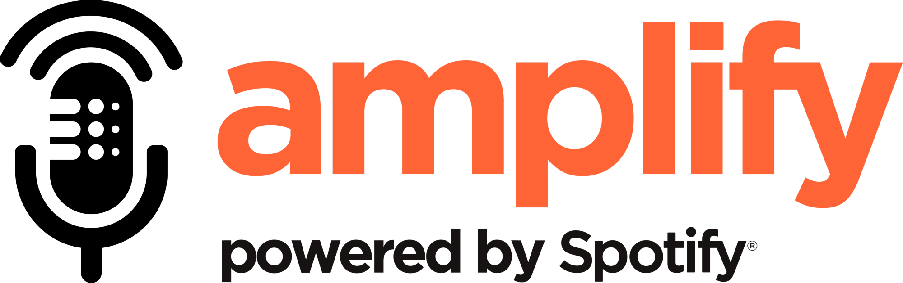

### At **amplify**, we believe in the power of live music. Live music is energetic, collaborative, and unpredictable. Fans have a unique opportunity to connect intimately with artists they love, and artists can connect in the same way with their fans. There are few things as powerful and invigorating. 

### amplify is inspired by our desire to bring artists and venues together to help live music flourish. Using amplify, venues can find artists who are well suited for their unique space and artists can find the right venues to attract their fans. 

### Under the hood, amplify uses proprietary algorithms that leverage historical sales data, real-time artist popularity, weather, seasonality, fan base composition, and more to help match artists and venues.

### [Use amplify!](https://amplify-artist-booking.herokuapp.com/ "Amplify Artist Booking")
&nbsp;

## About the App

**amplify** was built using historical data from local music venues, as well as artist data from **Spotify®**. Machine learning models were trained on this data, allowing accurate predictions of ticket sales and revenue, taking into account various factors including artist popularity, venue size, fan demographics, and even the month and day of week of the show. These models predict 4 categories with a range of statistical accuracy (R-squared) to build our full prediction dashboard. Advanced Ticket Sales (.99), Door Ticket Sales (.6), Ticket Price (.38), and Bar Revenue (.78).

## Tech Stack

* Initial data cleaning was performed using Python (e.g., Pandas, Numpy, etc.)
* Data warehousing is handled using a SQLite database
* A Flask application is used to handle queries to the database and return data to be displayed on the dashboard
* The app front-end was designed using Bootstrap along with multiple JavaScript libraries, including jQuery and noUiSlider
* Modeling was conducted using SKLearn and statsmodels
* The finished app has been deployed on Heroku

## The Team

* Andrew Swellie -- [GitHub](https://github.com/andrewswellie "Andy's GitHub")/[LinkedIn](https://www.linkedin.com/in/andrewswellie/ "Andy's LinkedIn")
* Robert Wood -- [GitHub](https://github.com/robert-rd-wood "Robert's GitHub")/[LinkedIn](https://www.linkedin.com/in/robert-rd-wood/ "Robert's LinkedIn")
* Justin Coulter -- [GitHub](https://github.com/JustinCoulter "Justin's GitHub")/[LinkedIn](https://www.linkedin.com/in/justin-coulter-69641817a/ "Justin's LinkedIn")
* Mike Bowen -- [GitHub](https://github.com/oyamatsumi04 "Mike's GitHub")/[LinkedIn](https://www.linkedin.com/in/michael-bowen-77513340/ "Mike's LinkedIn")

